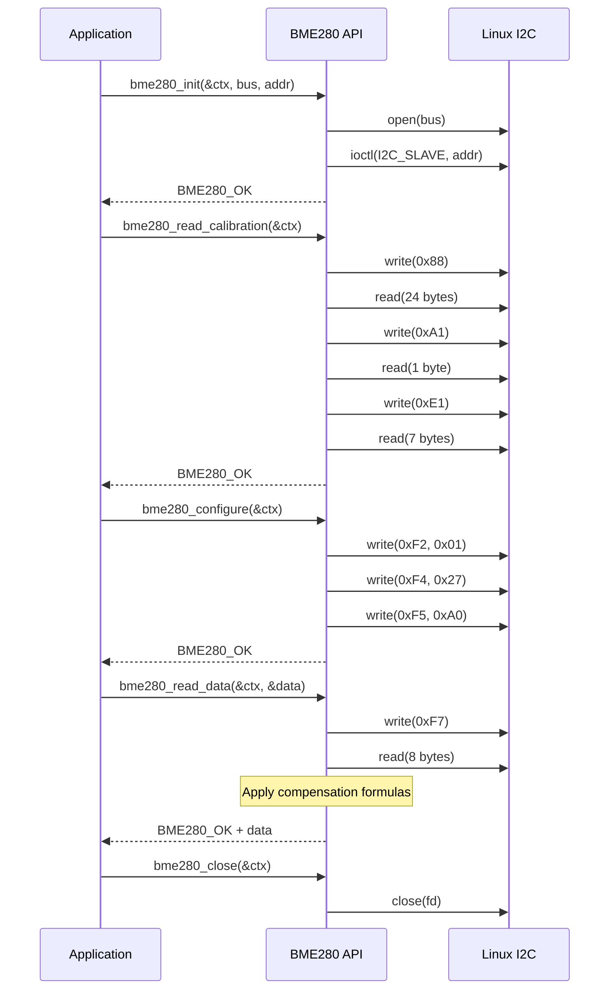

# Design Document: BME280 C Driver Enhancement

## Overview

This design describes the enhanced BME280 sensor driver for BeagleBone Black (Linux). The driver provides a modular, reusable C library for reading temperature, pressure, and humidity data from the BME280 I2C sensor. The design emphasizes proper error handling, type safety, and clean separation between the library interface and implementation.

## Architecture

The enhanced driver follows a layered architecture:

```
┌─────────────────────────────────────┐
│         Application Layer           │
│         (example_main.c)            │
└─────────────────┬───────────────────┘
                  │
┌─────────────────▼───────────────────┐
│         BME280 API Layer            │
│         (bme280.h / bme280.c)       │
│  - Initialization                   │
│  - Configuration                    │
│  - Data Reading                     │
│  - Resource Cleanup                 │
└─────────────────┬───────────────────┘
                  │
┌─────────────────▼───────────────────┐
│         Linux I2C Layer             │
│         (linux/i2c-dev.h)           │
│  - File operations                  │
│  - ioctl for I2C slave address      │
└─────────────────────────────────────┘
```

### File Organization

```
C/
├── bme280.h          # Public API header
├── bme280.c          # Library implementation
└── example_main.c    # Example usage program
```

## Components and Interfaces

### Error Code Enumeration

```c
typedef enum {
    BME280_OK = 0,
    BME280_ERR_BUS_OPEN,      // Failed to open I2C bus
    BME280_ERR_ADDR_SET,      // Failed to set I2C slave address
    BME280_ERR_WRITE,         // I2C write operation failed
    BME280_ERR_READ,          // I2C read operation failed
    BME280_ERR_NULL_PTR,      // NULL pointer passed to function
    BME280_ERR_NOT_INIT       // Device not initialized
} bme280_error_t;
```

### Public API Functions

#### Initialization

```c
/**
 * Initialize BME280 sensor connection
 * @param ctx      Pointer to context structure (caller-allocated)
 * @param bus_path I2C bus device path (e.g., "/dev/i2c-1")
 * @param address  I2C device address (typically 0x76 or 0x77)
 * @return BME280_OK on success, error code on failure
 */
bme280_error_t bme280_init(bme280_ctx_t *ctx, const char *bus_path, uint8_t address);
```

#### Read Calibration Data

```c
/**
 * Read calibration coefficients from sensor
 * @param ctx Pointer to initialized context
 * @return BME280_OK on success, error code on failure
 */
bme280_error_t bme280_read_calibration(bme280_ctx_t *ctx);
```

#### Configure Sensor

```c
/**
 * Configure sensor operating mode
 * @param ctx Pointer to initialized context
 * @return BME280_OK on success, error code on failure
 */
bme280_error_t bme280_configure(bme280_ctx_t *ctx);
```

#### Read Sensor Data

```c
/**
 * Read and compute all sensor measurements
 * @param ctx  Pointer to initialized context with calibration data
 * @param data Pointer to structure to receive computed values
 * @return BME280_OK on success, error code on failure
 */
bme280_error_t bme280_read_data(bme280_ctx_t *ctx, bme280_data_t *data);
```

#### Cleanup

```c
/**
 * Close I2C connection and release resources
 * @param ctx Pointer to context to close
 */
void bme280_close(bme280_ctx_t *ctx);
```

#### Error String Conversion

```c
/**
 * Convert error code to human-readable string
 * @param error Error code to convert
 * @return Pointer to static string describing the error
 */
const char* bme280_error_string(bme280_error_t error);
```

### Default Constants

```c
#define BME280_DEFAULT_ADDRESS  0x76
#define BME280_DEFAULT_BUS      "/dev/i2c-1"
```

## Data Models

### Calibration Data Structures

```c
typedef struct {
    uint16_t dig_T1;
    int16_t  dig_T2;
    int16_t  dig_T3;
} bme280_calib_temp_t;

typedef struct {
    uint16_t dig_P1;
    int16_t  dig_P2;
    int16_t  dig_P3;
    int16_t  dig_P4;
    int16_t  dig_P5;
    int16_t  dig_P6;
    int16_t  dig_P7;
    int16_t  dig_P8;
    int16_t  dig_P9;
} bme280_calib_press_t;

typedef struct {
    uint8_t dig_H1;
    int16_t dig_H2;
    uint8_t dig_H3;
    int16_t dig_H4;
    int16_t dig_H5;
    int8_t  dig_H6;
} bme280_calib_hum_t;

typedef struct {
    bme280_calib_temp_t  temp;
    bme280_calib_press_t press;
    bme280_calib_hum_t   hum;
} bme280_calib_t;
```

### Sensor Data Structure

```c
typedef struct {
    float temperature_c;   // Temperature in Celsius
    float temperature_f;   // Temperature in Fahrenheit
    float pressure_hpa;    // Pressure in hectopascals
    float humidity_rh;     // Relative humidity percentage
} bme280_data_t;
```

### Context Structure

```c
typedef struct {
    int           fd;       // I2C file descriptor (-1 if not open)
    uint8_t       address;  // I2C device address
    bme280_calib_t calib;   // Calibration coefficients
    int32_t       t_fine;   // Fine temperature for compensation
} bme280_ctx_t;
```

### Register Addresses

```c
// Calibration data registers
#define BME280_REG_CALIB_TEMP_PRESS  0x88  // 24 bytes: T1-T3, P1-P9
#define BME280_REG_CALIB_HUM1        0xA1  // 1 byte: H1
#define BME280_REG_CALIB_HUM2        0xE1  // 7 bytes: H2-H6

// Control registers
#define BME280_REG_CTRL_HUM          0xF2  // Humidity control
#define BME280_REG_CTRL_MEAS         0xF4  // Measurement control
#define BME280_REG_CONFIG            0xF5  // Configuration

// Data registers
#define BME280_REG_DATA              0xF7  // 8 bytes: P, T, H
```

### Sequence Diagram: Typical Usage




## Correctness Properties

*A property is a characteristic or behavior that should hold true across all valid executions of a system—essentially, a formal statement about what the system should do. Properties serve as the bridge between human-readable specifications and machine-verifiable correctness guarantees.*

Based on the prework analysis, most requirements for this driver are compile-time checks (type definitions, structure definitions, header organization) or require actual hardware to test (I2C communication). However, two key properties can be tested:

### Property 1: Compensation Formula Correctness

*For any* valid calibration coefficients and raw ADC values within the sensor's operating range, the compensation formulas SHALL produce temperature, pressure, and humidity values that match the BME280 datasheet reference implementation within floating-point tolerance.

**Validates: Requirements 1.4**

This property verifies that the core computation logic (the compensation formulas from the BME280 datasheet) is correctly implemented. We can test this by:
- Using known calibration data and raw ADC values
- Computing expected results using the reference formulas
- Verifying our implementation produces matching results

### Property 2: Error String Completeness

*For any* error code in the `bme280_error_t` enumeration, the `bme280_error_string()` function SHALL return a non-NULL, non-empty string that describes the error.

**Validates: Requirements 4.6**

This property ensures that all error codes have meaningful string representations, preventing NULL pointer dereferences when logging errors.

## Error Handling

### Error Propagation Strategy

All public API functions return `bme280_error_t` to indicate success or failure. The caller is responsible for checking return values and handling errors appropriately.

```c
bme280_error_t err;
bme280_ctx_t ctx;
bme280_data_t data;

err = bme280_init(&ctx, BME280_DEFAULT_BUS, BME280_DEFAULT_ADDRESS);
if (err != BME280_OK) {
    fprintf(stderr, "Init failed: %s\n", bme280_error_string(err));
    return 1;
}
```

### Error Code Definitions

| Error Code | Value | Description |
|------------|-------|-------------|
| BME280_OK | 0 | Operation successful |
| BME280_ERR_BUS_OPEN | 1 | Failed to open I2C bus device |
| BME280_ERR_ADDR_SET | 2 | Failed to set I2C slave address |
| BME280_ERR_WRITE | 3 | I2C write operation failed |
| BME280_ERR_READ | 4 | I2C read operation failed or incomplete |
| BME280_ERR_NULL_PTR | 5 | NULL pointer passed to function |
| BME280_ERR_NOT_INIT | 6 | Context not properly initialized |

### Resource Cleanup on Error

When `bme280_init()` fails after opening the I2C bus, it must close the file descriptor before returning to prevent resource leaks:

```c
bme280_error_t bme280_init(bme280_ctx_t *ctx, const char *bus_path, uint8_t address) {
    if (ctx == NULL || bus_path == NULL) {
        return BME280_ERR_NULL_PTR;
    }
    
    ctx->fd = open(bus_path, O_RDWR);
    if (ctx->fd < 0) {
        return BME280_ERR_BUS_OPEN;
    }
    
    if (ioctl(ctx->fd, I2C_SLAVE, address) < 0) {
        close(ctx->fd);
        ctx->fd = -1;
        return BME280_ERR_ADDR_SET;
    }
    
    ctx->address = address;
    return BME280_OK;
}
```

## Testing Strategy

### Dual Testing Approach

Due to the hardware-dependent nature of this driver, testing is split into two categories:

1. **Unit Tests**: Verify logic that can be tested without hardware
2. **Property Tests**: Verify universal properties of the compensation algorithms

### Unit Tests (Examples)

These tests verify specific behaviors without requiring actual BME280 hardware:

1. **Invalid bus path test**: Verify `bme280_init()` returns `BME280_ERR_BUS_OPEN` when given a non-existent bus path
2. **Close behavior test**: Verify `bme280_close()` sets `ctx->fd` to -1
3. **Default constants test**: Verify `BME280_DEFAULT_ADDRESS` equals `0x76` and `BME280_DEFAULT_BUS` equals `"/dev/i2c-1"`
4. **Include guards test**: Verify `bme280.h` contains proper include guards

### Property-Based Tests

Property-based tests use randomized inputs to verify the compensation formulas:

**Test Configuration**:
- Framework: Custom test harness (C has limited PBT libraries)
- Minimum iterations: 100 random test cases per property
- Tag format: `/* Feature: bme280-c-enhancement, Property N: description */`

**Property 1 Test Strategy**:
- Generate random calibration coefficients within valid ranges
- Generate random ADC values within 20-bit range (0 to 0xFFFFF)
- Compute expected values using reference implementation
- Compare with our implementation within tolerance (0.01 for temperature, 0.1 for pressure, 0.1 for humidity)

**Property 2 Test Strategy**:
- Iterate through all values in `bme280_error_t` enumeration
- Call `bme280_error_string()` for each
- Verify result is not NULL and not empty string

### Test File Organization

```
C/
├── bme280.h
├── bme280.c
├── example_main.c
└── test/
    ├── test_bme280.c       # Unit tests and property tests
    └── Makefile            # Test build configuration
```

### Build and Run Tests

```bash
cd C/test
make
./test_bme280
```
